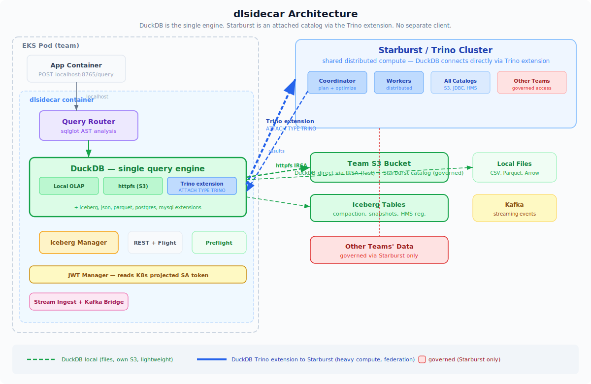
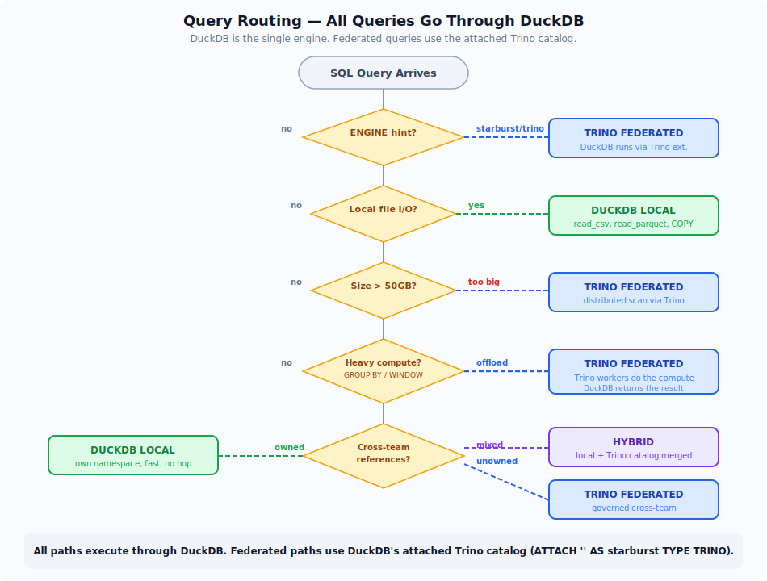
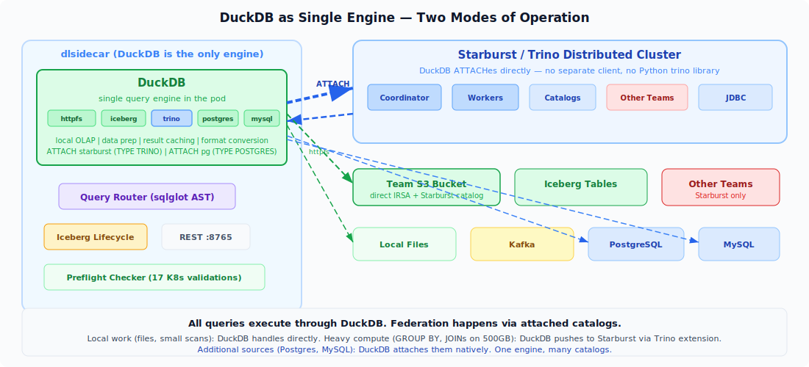
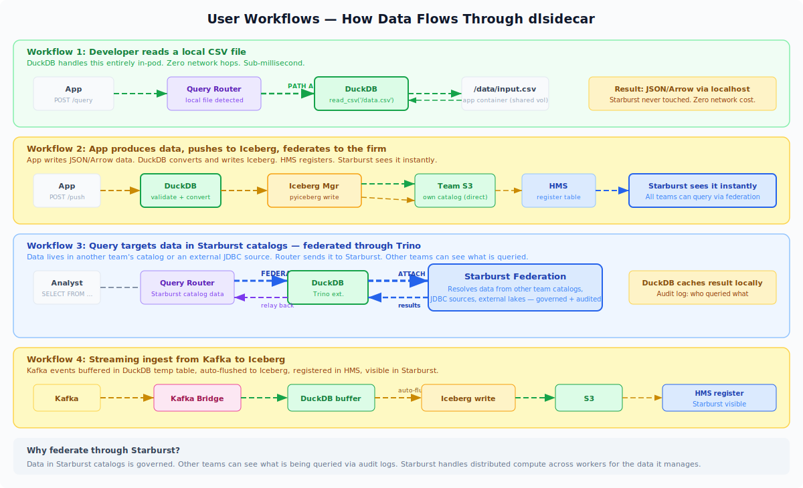

# dlsidecar — Data Lake as a Service

**A sidecar container that gives any EKS pod instant, governed, federated data access.**

DuckDB handles lightweight local work inside the pod. Starburst handles heavy distributed compute across the enterprise. The query router decides which engine runs each query — automatically.

<p align="center">
  
</p>

---

## The Core Idea

Every team needs data. Today, they either:
1. Stand up their own pipeline (weeks of infra work, no governance)
2. File a ticket with the platform team (days of waiting)
3. Copy data into a local database (stale, ungoverned, expensive)

**dlsidecar eliminates all three.** Attach a sidecar to your pod, get a SQL endpoint on localhost. The sidecar handles routing, caching, governance, Iceberg lifecycle, and cross-team federation — transparently.

### Two engines, one interface

| | DuckDB (in-pod) | Starburst (shared cluster) |
|---|---|---|
| **Role** | Lightweight client | Distributed compute |
| **Good at** | Local files, data prep, small scans, caching | Heavy analytics, cross-team joins, governed federation |
| **Latency** | Sub-millisecond (localhost) | Network hop to cluster |
| **Data access** | Team's own S3 bucket via IRSA | All-team catalogs, JDBC sources |
| **Cost** | Pod memory only | Shared cluster, amortized |

The query router uses **sqlglot AST analysis** to decide which engine handles each query:

<p align="center">
  
</p>

### Routing decision boundary

```
PATH A — DuckDB (lightweight, in-pod)
  Local CSV/Parquet/Arrow files
  Team's own S3 bucket (IRSA, no Starburst hop)
  Small scans under 50GB
  Data preparation (COPY, CREATE TABLE AS, INSERT)

PATH B — Starburst (distributed compute)
  Cross-team table references
  Heavy analytics (GROUP BY, WINDOW, CUBE)
  Scans over 50GB
  Explicit hint: /*+ ENGINE(starburst) */

PATH C — Hybrid (DuckDB orchestrates, Starburst computes)
  JOINs across owned and unowned sources
  Starburst resolves foreign side
  DuckDB joins with local data

PATH D — DuckDB pushdown to Starburst
  DuckDB offloads entire query to Starburst
  Receives results, caches/transforms locally
  DuckDB is the relay — Starburst chefs the answers
```

<p align="center">
  
</p>

### User Workflows

Five concrete scenarios showing how data flows through the system:

<p align="center">
  
</p>

---

## Quickstart

### Dev mode (3 lines)

```bash
# Add sidecar to any pod
helm install dlsidecar ./deploy/helm/dlsidecar \
  --set config.mode=dev \
  --set config.s3_buckets=my-team-data

# Query from your app
curl -X POST localhost:8765/query \
  -H 'Content-Type: application/json' \
  -d '{"sql": "SELECT * FROM read_parquet(\"/data/*.parquet\") LIMIT 10"}'
```

### Production (with governance)

```bash
helm install dlsidecar ./deploy/helm/dlsidecar \
  -f deploy/examples/full-readwrite.yaml
```

See [deploy/examples/](deploy/examples/) for minimal-readonly, full-readwrite, and streaming-ingest presets.

---

## API Reference

### Query (pull data out)

```
POST /query              Sync query, format: json|arrow|parquet|csv
GET  /query/stream       SSE stream (JSON) or chunked HTTP (Arrow IPC)
POST /query/async        Returns job_id, poll GET /query/async/{id}
Arrow Flight do_get      High-throughput columnar pull (:8766)
```

### Push (data into the lake)

```
POST /push               Write data: inline JSON, base64 Arrow/Parquet, S3 path
                         Target: iceberg | s3_parquet | duckdb_table
                         Mode: append | overwrite | merge
```

### Stream (continuous ingest)

```
POST   /stream/open              Open stream -> {stream_id}
PUT    /stream/{id}/batch        Arrow RecordBatch chunk
POST   /stream/{id}/commit       Flush -> Iceberg snapshot
DELETE /stream/{id}              Abort, discard buffer
```

### Catalog and Sources

```
GET  /catalog/tables             All tables across all sources
GET  /catalog/table/{db}/{tbl}   Describe table schema
GET  /sources/                   Source health status
POST /sources/attach             Attach source at runtime (dev)
```

### Iceberg Management

```
GET  /iceberg/health                   Per-table health report
POST /iceberg/maintenance/compaction   Trigger compaction
POST /iceberg/maintenance/snapshot-expiry
POST /iceberg/maintenance/orphan-cleanup?dry_run=true
POST /iceberg/maintenance/manifest-rewrite
```

### Observability

```
GET  /healthz     Liveness probe
GET  /readyz      Readiness probe (blocks until sources healthy)
GET  /status      Detailed component status
GET  /metrics     Prometheus metrics (30+ metrics)
```

---

## Iceberg Lifecycle Management

The sidecar owns the Iceberg lifecycle for tables it creates — no separate Spark job needed.

| Operation | Schedule | What it does |
|---|---|---|
| **Compaction** | `0 2 * * *` | Merges small files into 128MB targets |
| **Snapshot Expiry** | `0 3 * * *` | Expires snapshots older than 7 days (keeps min 5) |
| **Orphan Cleanup** | `0 4 * * *` | Removes unreferenced files (dry-run first) |
| **Manifest Rewrite** | `0 5 * * *` | Consolidates manifests when count > 100 |

Every write operation:
1. Writes data files via pyiceberg (never raw S3 puts)
2. Commits snapshot with summary properties
3. Registers/updates table in HMS (Starburst sees it immediately)
4. Performs schema evolution if needed (add columns, widen types)
5. Emits post-write metrics

---

## Governance

### Audit log

Every operation emits structured JSON to stdout (picked up by CloudWatch / Fluent Bit):

```json
{
  "ts": "2025-04-05T14:30:00Z",
  "event_type": "query",
  "tenant_id": "team-alpha",
  "engine": "duckdb",
  "sql_hash": "sha256...",
  "tables_accessed": ["mydb.events"],
  "duration_ms": 42,
  "rows_scanned": 100000,
  "engine_routed_reason": "owned_namespace"
}
```

### Row-level security

When `DLS_ROW_FILTER` is set, the sidecar injects a predicate into every DuckDB query via sqlglot AST transform:

```sql
-- Original
SELECT * FROM events

-- Rewritten (transparent to caller)
SELECT * FROM (SELECT * FROM events WHERE tenant_id = 'team-alpha') AS _governed
```

### The routing boundary IS the governance boundary

Cross-team data can only be accessed through Starburst, which enforces:
- JWT authentication (pod-level identity)
- TLS encryption in transit
- Catalog-level access control
- Full audit trail

---

## Onboarding UI

When `DLS_MODE=dev`, the sidecar launches a Streamlit app on port 3000 with:

| Page | Purpose |
|---|---|
| **Connection Wizard** | Step-by-step setup with live infra config generation |
| **Generated Config** | Copy-paste ConfigMap, Secret, Helm, NetworkPolicy YAML |
| **Env Promotion** | Visual diff between dev/staging/prod with validation |
| **Query Console** | SQL editor with routing badge and result viewer |
| **Push Console** | Upload data (JSON, Parquet, CSV, Arrow) to Iceberg |
| **Health Dashboard** | Source status, Iceberg health, audit log tail, JWT status |

The highest-leverage feature: **every datasource toggle in the wizard immediately emits the exact Kubernetes NetworkPolicy egress YAML** that the developer needs for their infra PR. No guessing ports, no wrong namespace selectors.

---

## Project Structure

```
dlsidecar/
  src/dlsidecar/
    config.py                  Pydantic-settings, all env vars, presets
    main.py                    FastAPI lifespan, startup wiring
    engine/
      query_router.py          Core routing logic (sqlglot AST)
      duckdb_engine.py         Thread-safe DuckDB singleton
      cache.py                 LRU with Iceberg snapshot invalidation
      scale_router.py          MotherDuck bridge
    sources/                   13 data source connectors
    iceberg/                   Manager, maintenance, reader, health
    api/                       8 REST endpoint modules
    flight/                    Arrow Flight server
    streaming/                 Stream ingest + Kafka bridge
    governance/                Audit, metrics, row filter
    auth/                      JWT manager
    connections/               Registry with health loop
    onboarding/                Egress generator, promoter, validator, Streamlit UI
  deploy/
    helm/dlsidecar/            Helm chart with preset system
    examples/                  3 deployment presets
  tests/                       93 tests (30 router, 10 egress, governance, API)
  docs/
    images/                    Architecture SVG diagrams (animated)
    scenarios/                 Executive-facing Q&A walkthroughs
```

---

## Environment Variables

All prefixed `DLS_`. See [config.py](src/dlsidecar/config.py) for the full schema with types, defaults, and validators.

| Category | Key vars | Purpose |
|---|---|---|
| Core | `DLS_MODE`, `DLS_TENANT_ID`, `DLS_OWNED_NAMESPACES` | Identity and routing |
| S3 | `DLS_S3_BUCKETS`, `DLS_S3_REGION` | Team bucket access |
| Starburst | `DLS_STARBURST_HOST`, `DLS_STARBURST_PORT` | Distributed compute |
| Iceberg | `DLS_ICEBERG_CATALOG_TYPE`, `DLS_ICEBERG_WAREHOUSE` | Table lifecycle |
| DuckDB | `DLS_DUCKDB_MEMORY_LIMIT`, `DLS_DUCKDB_THREADS` | Local engine config |
| Governance | `DLS_ROW_FILTER`, `DLS_ENABLE_QUERY_LOG` | Row-level security |

---

## Preflight Health Checker

The sidecar reads Kubernetes resources from inside the pod and validates the full connection chain. 17 checks covering K8s environment, IRSA, JWT, DNS, S3, Starburst, HMS, NetworkPolicy alignment, and resource limits.

```bash
curl -s localhost:8765/healthcheck/preflight | jq .summary
# {"healthy": true, "passed": 14, "warned": 2, "failed": 0, "skipped": 1}
```

Every failure includes an actionable fix with the exact YAML to apply. See [Health Check Guide](docs/scenarios/08-health-check-guide.md).

---

## Testing

```bash
uv venv .venv && source .venv/bin/activate
uv pip install -e ".[dev]"
pytest tests/ -v
```

93 tests cover:
- **30 router tests**: every routing branch, hint parsing, edge cases
- **10 egress tests**: NetworkPolicy generation for each datasource
- **Governance**: audit log schema, row filter injection, metrics
- **API**: health, readyz, metrics endpoint
- **Iceberg**: type mapping, schema evolution, maintenance guards
- **Starburst**: JWT rotation, pool lifecycle

---

## Executive Scenarios

See [docs/scenarios/](docs/scenarios/) for walkthrough answers to common executive questions:

- [Why a sidecar?](docs/scenarios/01-why-sidecar.md) -- cost, latency, governance, DX
- [Cost model](docs/scenarios/02-cost-model.md) -- dlsidecar vs Spark vs Snowflake
- [Governance at scale](docs/scenarios/03-governance.md) -- audit, RLS, routing boundary
- [Data flow examples](docs/scenarios/04-data-flow.md) -- 5 concrete query scenarios
- [Onboarding time](docs/scenarios/05-onboarding.md) -- minutes vs weeks
- [Iceberg lifecycle](docs/scenarios/06-iceberg-lifecycle.md) -- no separate Spark needed
- [Federation architecture](docs/scenarios/07-federation-architecture.md) -- the routing boundary

---

## License

MIT
